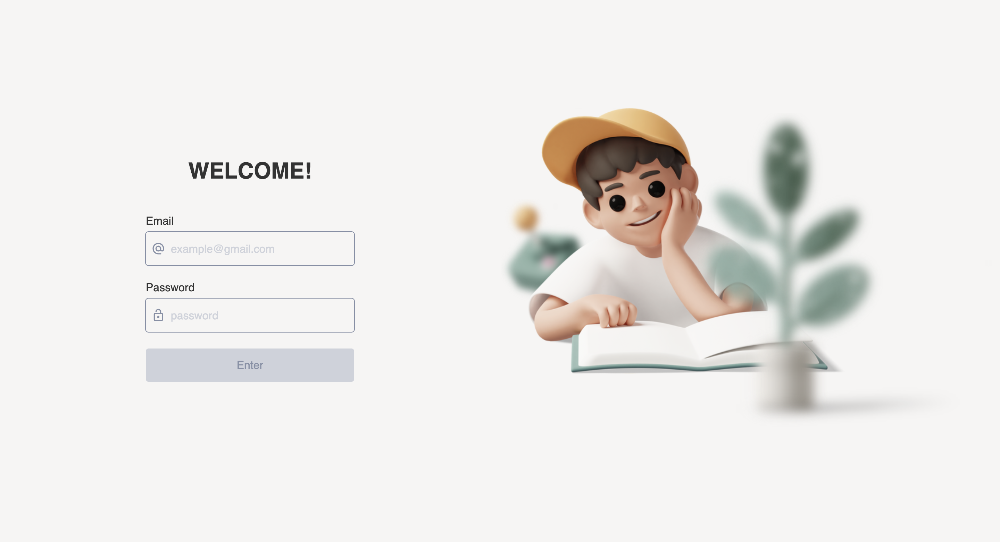
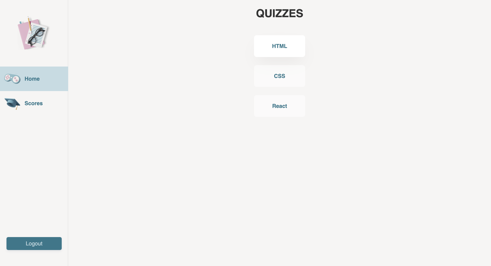
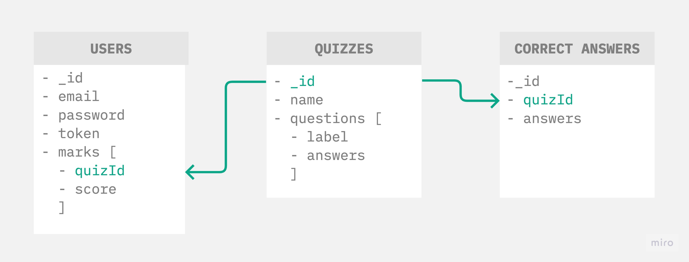

# OSKI - User testing application on MERN stack

- User should to sign in into application.
- User can only see and pass tests that have been assigned to him.
- Once user completed the test, his mark stored and user can see the test as completed without ability to retake it.

## 1. Frontend

- "npm start" runs the app in the development mode on [http://localhost:3000](http://localhost:3000)
- framework: React;
- requests & state: React-Query + Axios;
- forms: Formik + Yup;
- styles: StyledComponents;
- adaptive: mobile first / tablet / desktop;

## 2. Backend

- "npm run dev" runs the server in the development mode on [http://localhost:8080](http://localhost:8080)
- database: MongoDB;
- models: Mongoose;
- authorization: Jsonwebtoken & Bcrypt;
- validation: Joi;
- [Swagger](https://app.swaggerhub.com/apis-docs/UliaBojko/OSKI/1.0.0)

